# 【长线】实时关注招聘

**测评一定要刷题** 不然真的说不定哪次就挂了

**人生时间线**
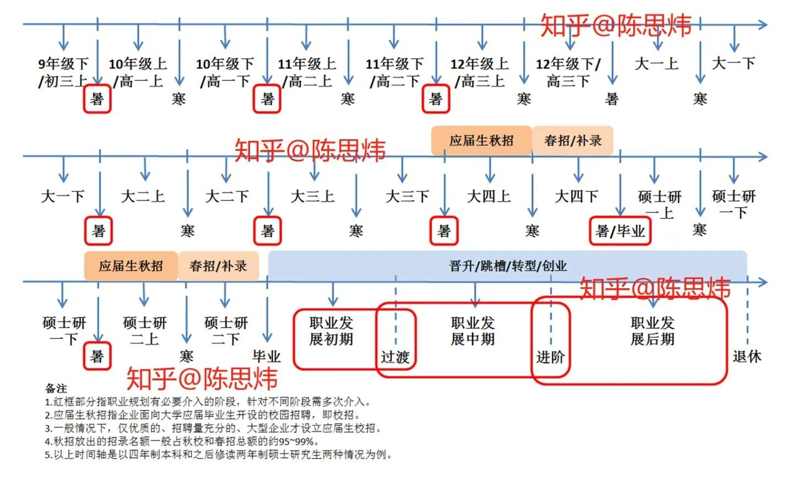

## 时间线梳理

<a href='https://zhuanlan.zhihu.com/p/506138795?utm_id=0'>
【校友职业访谈】进到安永好组，跟清晰的方法和规划有关
</a>

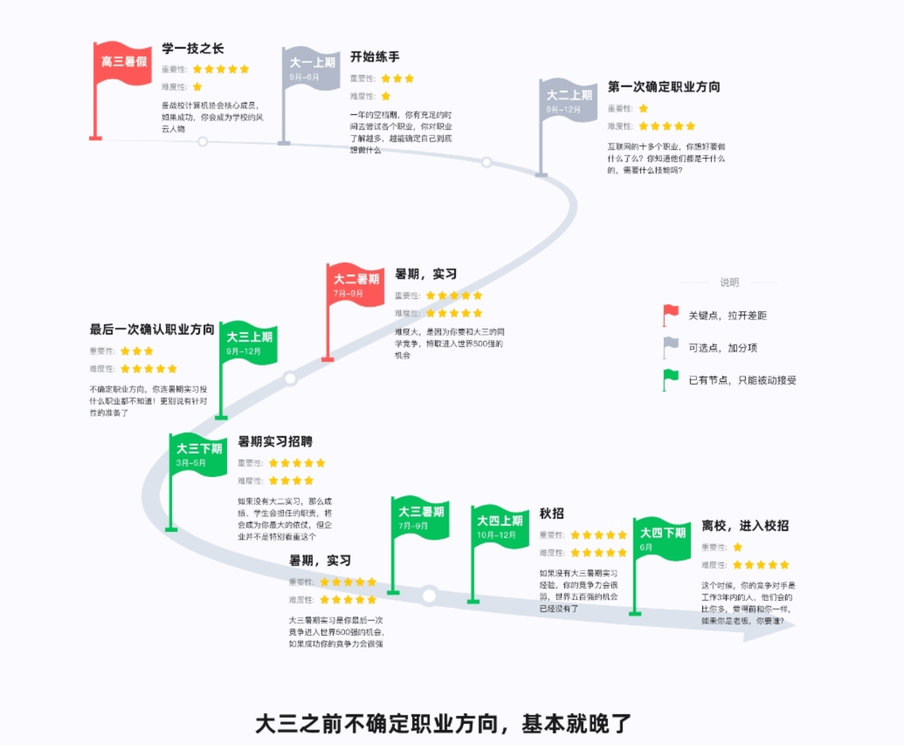

<a href='https://www.nowcoder.com/discuss/365606328222461952'>
23届校招时间线梳理
</a>

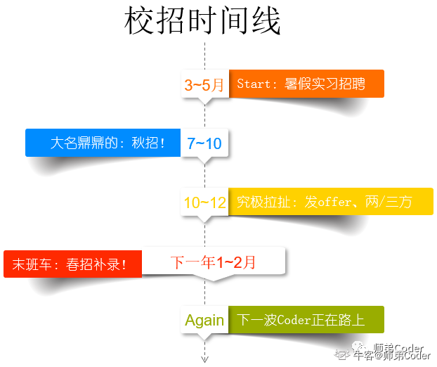

<a href='https://blog.csdn.net/sihai12345/article/details/114258312'>
应届生如何准备校招，用我这一年的校招经历告诉你
</a>

> 在现在的校招的模式下，校招分为春招和秋招，春招基本上是找实习的，还是少量的校招补招的，补招就是上一年秋招没有招满，然后在春招继续招人，而秋招基本上就是应届生找工作的最佳时期了。

<a href='https://www.zhihu.com/question/536361330/answer/2586846953'>
2023届秋招什么时候开始?
</a>

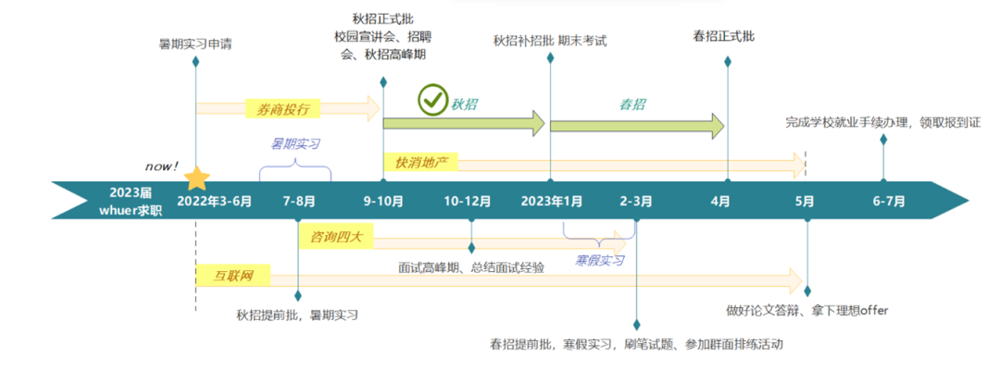

<a href='https://blog.csdn.net/QIANDXX/article/details/119008711'>
校招时间线
</a>

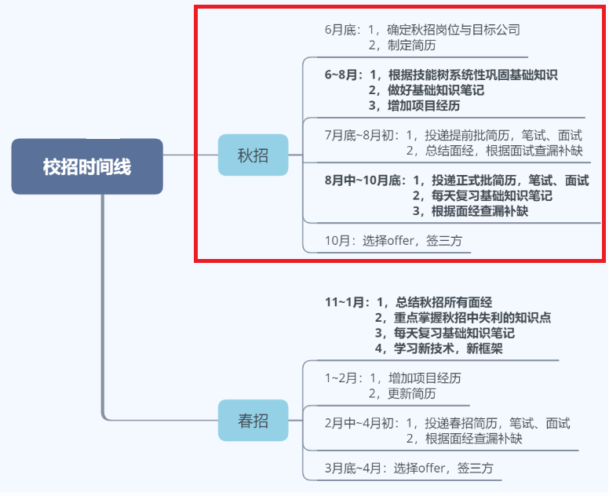

<a href='https://www.sohu.com/a/256811166_241317'>
香港求职时间线
</a>

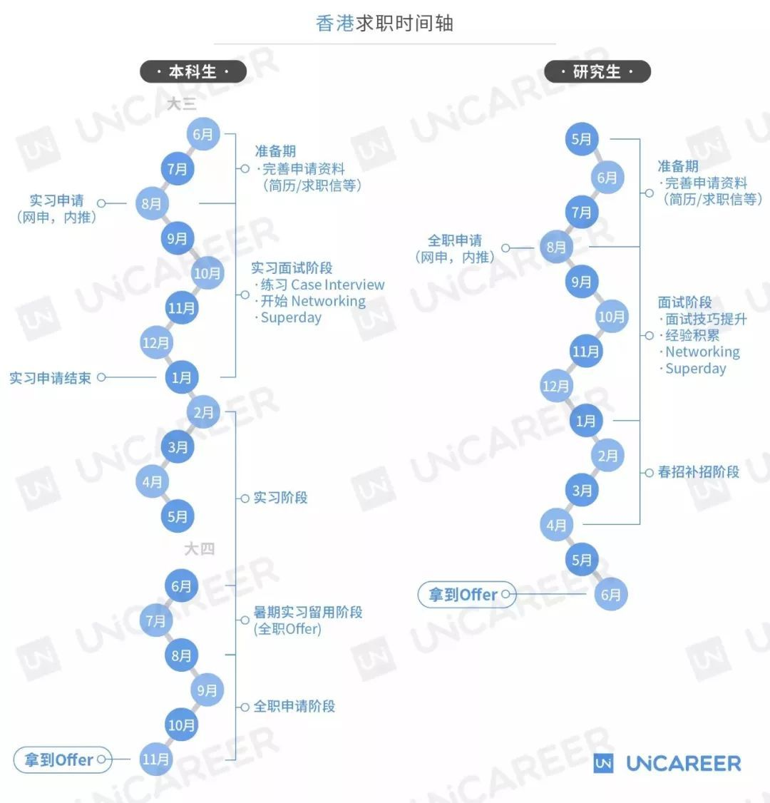

<a href='https://zhuanlan.zhihu.com/p/391605082'>
秋招准备时间线+留学生求职时间规划
</a>

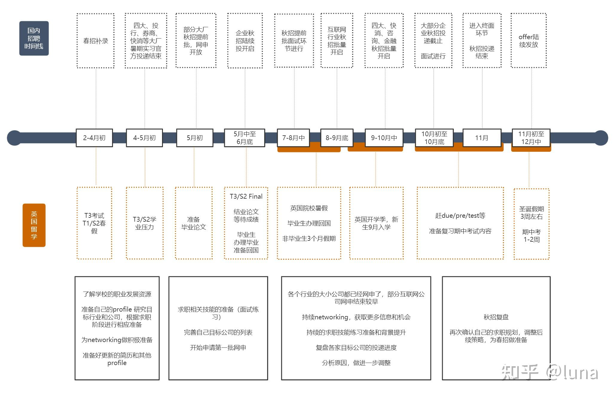

<a href='https://zhuanlan.zhihu.com/p/391008262'>
校招困惑12|关于秋招的正确时间线
</a>

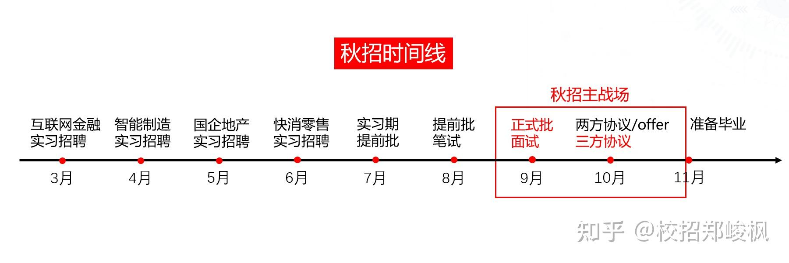

## 从 HR 视角

### BOSS 直聘 HR 视角
- https://www.nowcoder.com/discuss/590140680614273024

## 真实面试实战记录
- [美团直播面试返场！【前端+后端】一手面经大放送！](https://mp.weixin.qq.com/s/d-Y4BrNC-OHGxC2lSZJVew)
  - 可以翻一翻往期的直播回放

## 外企盘点
- [有哪些值得计算机专业加入的外企？](https://www.nowcoder.com/discuss/421302444962902016)
- [盘点一波可以投的外企](https://www.nowcoder.com/discuss/496284926262648832)

## 总结
- [赛文的战绩回顾](https://web.archive.org/web/20231217083849/https://www.nowcoder.com/discuss/565110678436970496?sourceSSR=dynamic)，24 届，2023 年 12 月彻底结束自己招聘流程
    - 需要三百天时间来刷题，纯刷题时间要三百天
    - 准备时间 9 个月，力扣 643，折合一个月 70 道
- 至少也要提前一个季度时间准备刷题
  - 实习招聘开得早的基本在 12 月底到 1 月初的样子，提前一个季度也就是 10 月 1 号就要开始陆续开始慢慢刷力扣了
  - 秋招提前批之前要刷满 500
  - 实习要刷满 100-200 的样子
  - 刷题速度 一个月 100 道？
    - 看下这几个人
    - [腾讯｜前端实习｜一二三 + HR面面经，已offer｜2021｜](https://leetcode.cn/circle/discuss/KCuwCC/)
      - 东莞理工学院，力扣时间大概三个月，277 道
    - [春招面经 | 字节三面凉经](https://leetcode.cn/circle/discuss/14FbAo/)
      - 一年多刷了 1415 基本上折合一个月 100 题
    - [面经｜阿里巴巴｜23实习](https://leetcode.cn/circle/discuss/RuYnO3/)
      - 这个比较有参考性，时间节点踩得比较准；中国矿业大学
      - 大二暑假开始刷力扣，淘宝实习正式批 3 月份开，也就没有刷题了
      - 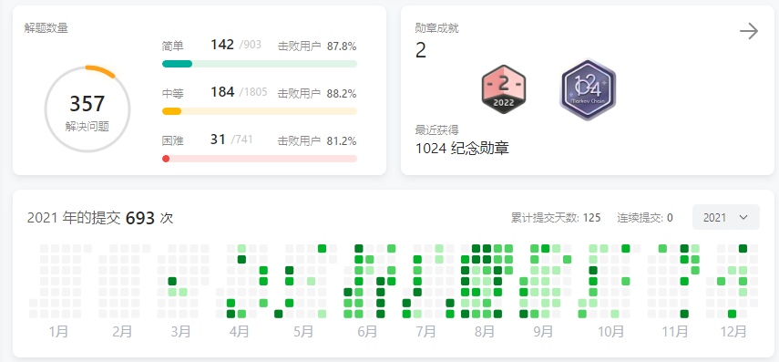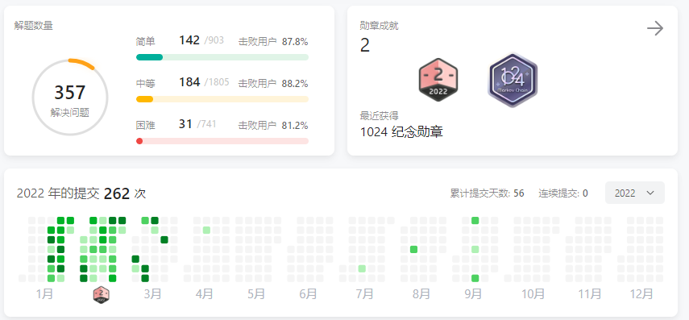
    - 那么总结一下，如果要秋招提前批稳住，每个月刷题强度拉满，一个月 100 题，最晚最晚也就是 2 月 1 号就需要开始刷题了，到 7 月 1 号刚好五个月 500 题。到 3 月份实习正式批刚好一百题
  - 看别人很多都是大三上一开学就开始刷力扣了
  - 再总结一下，根据这几个佬的刷记录，大概是时间充裕一点的一个月 100 题，时间少的一个月 50 题
- 刷题大佬
  - [大二分享丨刷题1000题感想](https://leetcode.cn/circle/discuss/vRHnOj)
  - [大一 入学就刷力扣 400 题](https://leetcode.cn/circle/discuss/vRHnOj/view/YGovdZ/)
  - [大二 力扣350道，hot100马上二刷完](https://www.nowcoder.com/feed/main/detail/666d38126a4d4568a94785574bf9b599)
- 学院分享
  - [24届校招末班车🚙 三本 哈啰Java OC啦~](https://web.archive.org/web/20240405142240/https://www.nowcoder.com/discuss/605798991095140352)

## 信息差
- [所有应届生都应该的春招神器！](https://www.nowcoder.com/discuss/466002314088693760?sourceSSR=users)
- [盘点下23届秋招薪资](https://www.nowcoder.com/discuss/451473758486794240?sourceSSR=users)
- [本科清华，大二上的寒假都开始找实习了，双非还有什么理由不找](https://www.nowcoder.com/discuss/468482006947483648)
  - wayback 备份: https://web.archive.org/web/20240218091520/https://www.nowcoder.com/discuss/468482006947483648

## 感悟
- 面试官锐评：通过看你的简历，你的实践和动手能力应该是有的，但其实这些东西对于大家**都是名校的同学来说，学会都是很快的，不会有什么壁垒**。对于校招生，我们更多的还是考察基础原理方面的知识，以及个人的一些额外思考。
    - [腾讯IEG前端二面（2024.3.4）](https://www.nowcoder.com/feed/main/detail/51b86da92371415ea00b7c62a2389e3e)
- 越厉害的学校信息被抹平的越彻底
  - [北邮✌️ 26 届找实习之旅](https://web.archive.org/web/20240414012422/https://www.nowcoder.com/discuss/607197800605970432) [screenshot](https://web.archive.org/web/20240414012513/http://web.archive.org/screenshot/https://www.nowcoder.com/discuss/607197800605970432)

## 企业招聘记录
<!-- 只记录**正式批**和**实习**，**不**记录**提前批** -->

2024 届招聘时间线

2025 届招聘时间线

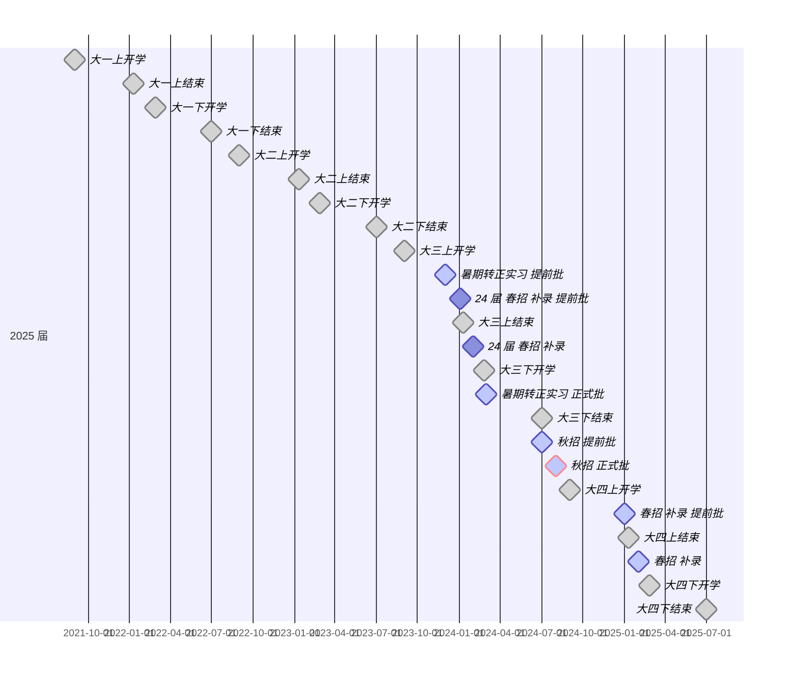

2026 届招聘时间线

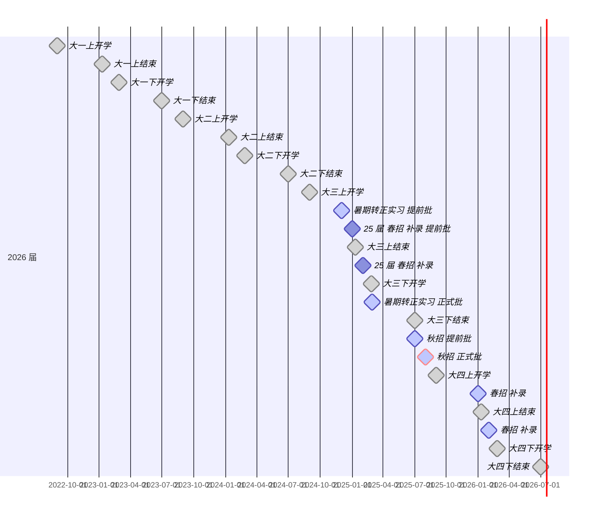

- 总结时间线 2023 毕业

  - 2021-12: **2023** 届 暑期实习 提前批
  - 2022-01: 2022 届 春招 补录 提前批
  - 2022-02: 2022 届 春招 补录
  - 2022-03: **2023** 届 暑期实习 正式批
  - 2022-07: **2023** 届 秋招 提前批
  - 2022-08: **2023** 届 秋招 正式批
  - ===
  - 2022-12: **2024** 届 暑期实习 提前批
  - 2023-01: 2023 届 春招 补录 提前批
  - 2023-02: 2023 届 春招 补录
  - 2023-03: **2024** 届 暑期实习 正式批
  - 2023-07: **2024** 届 秋招 提前批
  - 2023-08: **2024** 届 秋招 正式批
  - ===
  - 2023-12: **2025** 届 暑期实习 提前批
  - 2024-01: 2024 届 春招 补录 提前批
  - 2024-02: 2024 届 春招 补录
  - 2024-03: **2025** 届 暑期实习 正式批
  - 2024-07: **2025** 届 秋招 提前批
  - 2024-08: **2025** 届 秋招 正式批
  - ===
  - 2024-12: **2026** 届 暑期实习 提前批
  - 2025-01: 2025 届 春招 补录 提前批
  - 2025-02: 2025 届 春招 补录
  - 2025-03: **2026** 届 暑期实习 正式批
  - 2025-07: **2026** 届 秋招 提前批
  - 2025-08: **2026** 届 秋招 正式批

- 谷歌
  - [谷歌开实习了](https://www.nowcoder.com/feed/main/detail/550a251cedab4fff9e9bcbbc9250e05c)
  - 录取的实习生将在 2024 年暑期在 Google 谷歌办公室进行为期 12-14 周的全职实习。
  - 我去翻了一下谷歌招聘包打听公众号历史记录，发现每年都是在 12 月初招收暑期实习生。校招正常 1 月春招
  - 更厉害的 STEP intern，招聘次次次年的毕业生（大二）。Software Engineering intern 是招聘次次年毕业生（大三）
  - [有人@你：不容错过的实习机会](https://mp.weixin.qq.com/s/PQRspmdwGZdaQMoPuoPfZQ) 2022-12-08
  - [2022年暑期技术类实习应募开启！](https://mp.weixin.qq.com/s/kN5hTgGgtGUVBYdfKiDJ8Q) 2021-12-03
  - 经验
    - [谷歌中国暑期实习 Google 2021 SWE Intern 申请经验](https://zhuanlan.zhihu.com/p/362736343)
      - lc 三百道肯定不够

- 腾讯
  - [腾讯2024校园招聘全面启动](https://mp.weixin.qq.com/s/y__uK-P0B1SWQKYu8DNhpw) 2023-08-17
  - [腾讯微信事业群2024校园招聘持续热招中！](https://mp.weixin.qq.com/s/UsNUjHNFX7F_siGi5zw2qw) 2023-12-14
  - [腾讯微信事业群实习生招聘进行中](https://mp.weixin.qq.com/s/D0_FT4MmQmYzLnMPf9g4tA) 2024-02-02

- 微软
  - [微软亚洲研究院2024校园招聘正式开启!](https://mp.weixin.qq.com/s/IApL8X7_dMXhfk5nisDlVQ) 2023-08-01
  - [校招 | 微软2024暑期实习招聘正式开启！](https://mp.weixin.qq.com/s/xfTHJx01Nk0TQ6gM5yAFBA) 2024-02-01

- 七牛云
  - [七牛云2023年春季实习生](https://mp.weixin.qq.com/s/WGH0XUSJIXt0ebaI6tvRlA) 2023-01-04
  - [七牛云2022年春季实习生](https://mp.weixin.qq.com/s/U17tEmjWpt1Bn5UA8-juCA) 2022-04-19
  - [七牛云2021春季实习生招聘](https://mp.weixin.qq.com/s/u5QlQ2dX8IyfgOguRWVVlA) 2021-02-23
  - [七牛云2020春季实习生招聘](https://mp.weixin.qq.com/s/QY_pnIoSH8vmC-47ToayQg) 2020-03-19
  - [七牛云2020届春季实习正式开启](https://mp.weixin.qq.com/s/xBBJg4EgkLq2td_T2W5VFA) 2019-03-04

- 阿里巴巴
  - [阿里巴巴春季2023届暑期实习](https://mp.weixin.qq.com/s/ImsLgsFI5o28pjWJObqDFg) 2022-02-28
  - [阿里巴巴集团春季实习生招聘](https://mp.weixin.qq.com/s/S6eYBxHFf_U4yNi5FsSQwA) 2022-04-11
  - [阿里巴巴秋季2023届秋招](https://mp.weixin.qq.com/s/icpSIIt0Z_oxJqNc8w3AEw) 2022-08-18
  - [阿里巴巴春季2024届实习生招聘](https://mp.weixin.qq.com/s/r9jJl6rLsK2Y_xa2D84wgQ) 2023-03-08
  - [阿里巴巴控股集团秋季2024届校园招聘](https://mp.weixin.qq.com/s/PEr8bQeyZh5fU6P7k9sNDQ) 2023-08-11
  - [阿里云2025届校园大使招募](https://mp.weixin.qq.com/s/RAlZze6euBMPHD3V6v1uvw) 2023-12-14
  - [钉钉春季2025届实习生招聘正式启动！](https://mp.weixin.qq.com/s/v7JSJjzBWOGu5lPEjAjl3Q) 2024-03-12

- 京东
  - [京东2024校园招聘](https://mp.weixin.qq.com/s/GIiWaJBNup0R4fxLXmWp0g) 2023-08-01
  - [实习｜致2025届的你一封信](https://mp.weixin.qq.com/s/qCrs75Vz7kJTaKdzzsbizg) 2023-09-12
  - [京东实习生](https://mp.weixin.qq.com/s/tYqvMqXMyG3X8Mva5ehDNA) 2023-03-06
  - [京东2023校园招聘春季补录](https://mp.weixin.qq.com/s/w-LdDjea1ZvyqYdTwtbJ9A) 2023-02-13
  - [京东2023校园招聘全面启动](https://mp.weixin.qq.com/s/MS_iH_osZOxmcuniIFd2ig) 2022-08-01

- 抖音
  - [字节跳动 2024 校园招聘正式启动](https://mp.weixin.qq.com/s/FyTpd6dsJ8IJEVAaOMkeww) 2023-08-10
  - [抖音 2024 提前批](https://mp.weixin.qq.com/s/t0PxlsDAKiC9u7f8Xpu6WA) 2023-07-11
  - [字节跳动 2023 实习生招聘](https://mp.weixin.qq.com/s/BX2MlxMWepxNhP1NxZAA7w) 2023-03-09
  - [字节跳动 2023 校园招聘正式启动](https://mp.weixin.qq.com/s/2xgtgjcDXD4CLl0oEsUFWg) 2022-08-10

  - 技术岗解析
    - [字节跳动技术岗解析 · 后端篇：一张图看懂后端技术体系](https://mp.weixin.qq.com/s/MCZCW36E3SylUsLPU-xAVA)

- 因特尔
  - [研发专场 | 英特尔全球实习生招聘“芯”动启航~](https://mp.weixin.qq.com/s/sWDVk6KL4D4XEVdq4vMIrw) 2023-11-02
  - [英特尔研发实习生招聘](https://mp.weixin.qq.com/s/5CDlOYMPmSvGY89JSjoEeQ) 2023-12-01
  - [招聘：intel 招聘实习生啦！岗位多多](https://www.nowcoder.com/feed/main/detail/8b1c1a82c6cc4e01af5fc4606168c950)

- VMware
  - [VMware|校招&实习+快上车](https://mp.weixin.qq.com/s/3JphPff7xeO6nQzOE6W-jw) 2022-06-22
  - [VMware实习|线上宣讲](https://mp.weixin.qq.com/s/HSWzvtPzgNVP6V77XRW2gQ) 2022-03-17
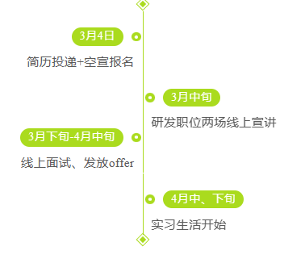
  - [VMware校招｜2022校园招聘正式启动](https://mp.weixin.qq.com/s/ZE0-Y2D4e-hGFUXjdrjw2Q) 2021-09-03
  - [VMware 2022校招提前招聘正式启动](https://mp.weixin.qq.com/s/nC2EmBsulPkUY5iKQ4vOgw) 2021-08-11
  - [VMware校招｜2021实习生职位](https://mp.weixin.qq.com/s/WcHIBHd1Gln7enzQ_paWDA) 2021-06-18
  - [VMware2021实习生招聘启动](https://mp.weixin.qq.com/s/ntXY9x3vCRs4R6rWNCihZQ) 2020-12-01

- 亚马逊
  - [全职+实习 | 亚马逊中国2024校园招聘](https://mp.weixin.qq.com/s/WJnRmTfO1GFpFopYT6SMoQ) 2023-11-14
  - [亚马逊中国2023校园招聘](https://mp.weixin.qq.com/s/kyHn_tUs-iXOlfWD_JnUeg) 2022-08-08
  - [亚马逊中国2022实习生](https://mp.weixin.qq.com/s/_E-CdOfzBLPYNOipjOXZ6w) 2022-02-25
  - [亚马逊中国2022年技术类实习生提前批](https://mp.weixin.qq.com/s/3PdlW8Ztu5AfWdphDa02BA) 2021-12-06
  - [【亚马逊】2025届暑期实习生 提前批！](https://www.nowcoder.com/discuss/565640329328590848) 2023-12-16

- 惠普
  - [惠普2023届秋季校园招聘](https://mp.weixin.qq.com/s/utWuL0AfM-FBB7vBnglB-Q) 2022-10-28
  - [2022中国惠普春季校园招聘](https://mp.weixin.qq.com/s/785-ivUBPgBfsthHT2YgeA) 2022-03-16
  - [惠普2022届校园招聘正式启动](https://mp.weixin.qq.com/s/fvgqw8MvOfxN7kGdh6kbqw) 2021-09-22
 
- vivo
  - [vivo 2024春季校招&暑期实习，全面启动！](https://mp.weixin.qq.com/s/H-kaamsoAAy1TLjUghkhYg) 2024-02-21

- 拼多多
  - [拼多多2025届研发实习生招聘正式启动！](https://mp.weixin.qq.com/s/O-XCEp22BC-GELLoSWHmjw) 2024-03-04

## 帮助手册
- [亚马逊校园招聘申请手册](https://amazonexteu.qualtrics.com/CP/File.php?F=F_55YI0e7rNdeoB6e)
