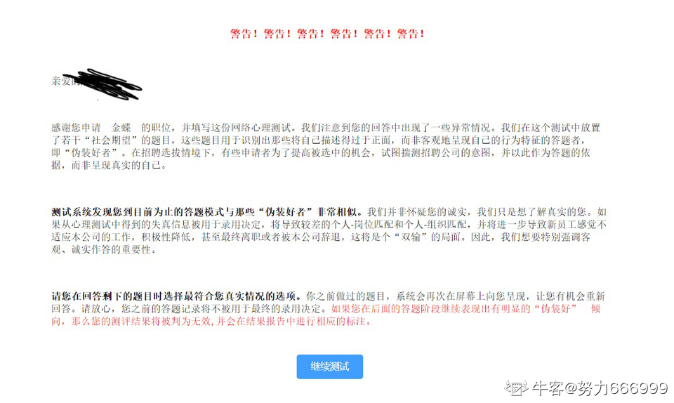

# 测评

**明确一点：测评是会挂/筛选人的**

- 因为我一开始接的志愿和本来想投的岗位不符合，然后我做完测评他就显示简历评估挂了，我以为是简历跟岗位不匹配，就又从boss上找的一个hr去转岗，他告知我测评没过就转不了了 真的离大谱     
  - [阿里云综合测评也会挂？](https://www.nowcoder.com/feed/main/detail/23a5f3ebc98b4f06a4f9717f09321a48?sourceSSR=search)
- 和我一样，今天淘天面试完10分钟发现流程终止，问了面试官说我技术面大的不错测评分太低了
  - [阿里云的测评挂了，还有机会吗](阿里云的测评挂了，还有机会吗)
- [北森测评挂](https://www.nowcoder.com/feed/main/detail/ced8ad4c62fb477ca5809a8ad96b16fe?sourceSSR=search)
- [金蝶测评被警告了](https://www.nowcoder.com/feed/main/detail/eb389991d5e4451e990f014301cf40be)
  - 
- [腾讯那个测评可以乱答吗？](https://www.nowcoder.com/feed/main/detail/cf463a0ff1f946839ea02d1c0cd87556?sourceSSR=search)
  - 等分太低，就会失去面试机会
- [携程测评挂了，真没绷住](https://www.nowcoder.com/feed/main/detail/09065ca4b40344b6b9bd458bfd99b723?sourceSSR=search)
  - `携程24内推DSv2ksfg` 官方回复：测评确实会挂的。HR说每一轮笔试和面试都会挂人，包括最后的英语测评，否则这一项流程就没有意义，得认真做呀。  
