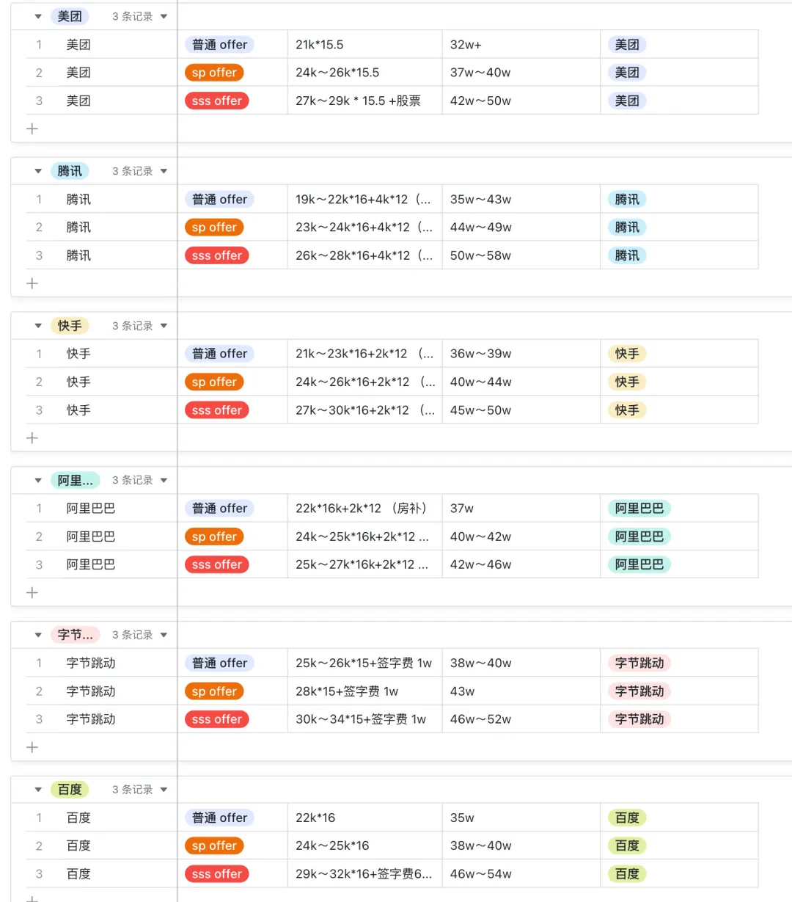

# 各个公司薪酬调研

## 腾讯

## 阿里
本科 p4 白菜 22
硕士 p5 白菜 24
sp 28

## 字节
转正 22
白菜 24 25
sp 26 28
ssp 30 32

## 百度

## 滴滴

## 快手

## 美团

## 24 届各家薪酬
> ref: https://mp.weixin.qq.com/s/BPqyKAhhCsDer2zjhg3oXQ

公积金
> ref: https://mp.weixin.qq.com/s/dx95eQ65A9wVdiThKff3mQ

